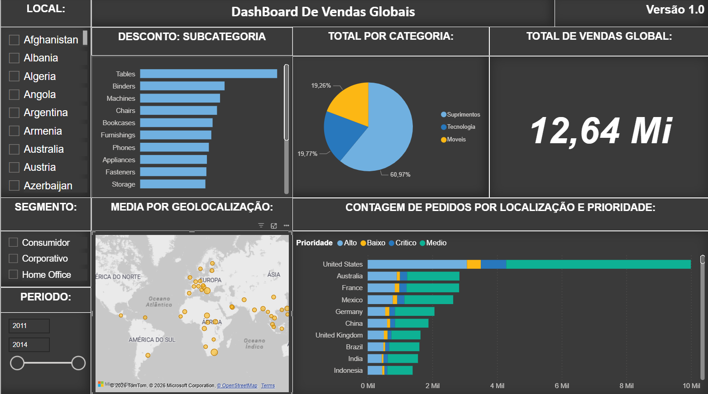

# Projeto Acadêmico Data Science Academy: Painel Interativo de Vendas Globais

## Visão Geral do Projeto

Este projeto, desenvolvido como parte do currículo da Data Science Academy (DSA), apresenta um painel de inteligência de negócios (BI) de última geração para análise e visualização de dados de vendas globais. O objetivo principal deste projeto é fornecer uma ferramenta de decisão estratégica que permite explorar padrões de vendas, tendências de desconto e prioridades de pedidos em escala global, utilizando dados simulados de transações comerciais.

O painel foi projetado para ser altamente interativo, permitindo que os usuários filtrem e façam perguntas complexas aos dados de forma intuitiva.

## Imagem do Painel

A imagem abaixo demonstra o layout e a funcionalidade do painel final (você pode incluir a imagem `image_0.png` no seu repositório).

## Principais Recursos e Análises

O painel é dividido em várias seções principais, cada uma focada em um aspecto crítico dos dados de vendas:

### 1. Filtros e Controles (Painel Esquerdo)

Esta seção permite o controle dinâmico de toda a visualização:

* **LOCAL (País):** Uma lista de seleção dinâmica de países para focar a análise em regiões geográficas específicas.
* **SEGMENTO (Segmento de Cliente):** Permite filtrar por tipo de cliente, incluindo 'Consumidor', 'Corporativo' e 'Home Office'.
* **PERIODO (Intervalo de Datas):** Um controle deslizante de data intuitivo que define o período de tempo para a análise (atualmente mostrando dados de 2011 a 2014).

### 2. KPIs e Métricas Globais (Topo Direito)

Um cartão de KPI proeminente que exibe a métrica de vendas mais importante:

* **TOTAL DE VENDAS GLOBAL:** O valor total acumulado das vendas globais para o período e filtros selecionados. (Exemplo na imagem: `12,64 Mi`).

### 3. Análise Detalhada (Painel Central)

* **DESCONTO: SUBCATEGORIA (Gráfico de Barras Horizontais):** Analisa a distribuição dos descontos concedidos em várias subcategorias de produtos, como Mesas, Pastas, Máquinas, Cadeiras, etc. Isso ajuda a identificar quais subcategorias estão mais sujeitas a reduções de preço.
* **TOTAL POR CATEGORIA (Gráfico de Pizza):** Visualiza a proporção de vendas totais por categoria principal de produto:
    * `Suprimentos` (60,97%)
    * `Tecnologia` (19,77%)
    * `Móveis` (19,26%)
* **MEDIA POR GEOLOCALIZAÇÃO (Mapa Interativo):** Um mapa múndi que utiliza bolhas ou marcadores para mostrar a média de vendas por localidade geográfica. Isso permite uma rápida identificação visual de mercados de alto e baixo desempenho. (Nota: O mapa utiliza dados de OpenStreetMap e TomTom).

### 4. Análise de Prioridade e Volume (Painel Inferior Direito)

* **CONTAGEM DE PEDIDOS POR LOCALIZAÇÃO E PRIORIDADE (Gráfico de Barras Empilhadas):** Compara o volume total de pedidos por país (ex: United States, Australia, France) e os divide por níveis de prioridade do pedido ('Alto', 'Baixo', 'Critico', 'Medio'). Isso é crucial para gerenciar a cadeia de suprimentos e as expectativas de atendimento ao cliente.

## Tecnologias e Ferramentas

O desenvolvimento deste painel envolveu o uso de várias tecnologias e técnicas de Ciência de Dados e Business Intelligence:

* **Microsoft Power BI** (ou software de BI similar): A plataforma principal usada para criar as visualizações, os filtros e a lógica de interação. (A atribuição do mapa e a aparência sugerem Power BI).
* **ETL (Extração, Transformação e Carga):** Preparação e limpeza dos dados de vendas brutas para garantir sua integridade e adequação à visualização.

## Estrutura do Repositório

Este repositório está organizado da seguinte forma:

* `/dashboard`: Arquivo do projeto de dashboard (ex: arquivo `.pbix` do Power BI).
* `/images`: Imagens e capturas de tela do painel.
* `README.md`: Este arquivo com a documentação do projeto.

## Como Visualizar e Usar

Para visualizar e interagir com o painel completo, você precisará ter o software de BI correspondente (ex: Power BI Desktop) instalado.

1.  Clone este repositório para o seu ambiente local.
2.  Abra o arquivo `.pbix` na pasta `/dashboard`.
3.  Utilize os filtros no lado esquerdo para detalhar os dados e explorar os insights.

## Autor

Este projeto foi desenvolvido por:

* **Ygor Nobrega**